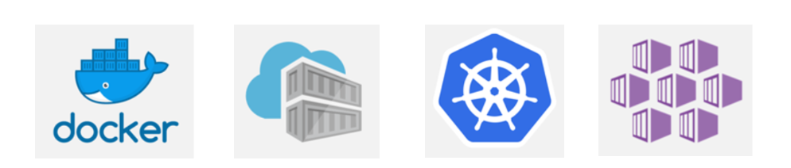

## Deploy Simple Node JS application into Azure Kubernetes Service

This repository contains a simple node js application that returns a sample portfolio html page after application started. This demo is simply to show how we can incoperate Azure Kubernetes service with docker and a NodeJS application.

#### Steps to get the project and run :desktop_computer:

- Clone or fork the application. `git clone https://github.com/Chabbax/Docker-Kubernetes-Demo.git`
- Open the application in VS Code or any other code editor `code .`
- Run `npm install` to install necessary dependencies.
- Run `npm run start` to run the application. The application will run on `http://localhost:8045` port.

#### Steps to create Docker image and run :whale:

- Run `docker image build -t portfolio-app:v1`. (This will create Docker image. :package:)
- Run `docker run -d -p 3000:8045 portfolio-app:v1` :rocket:
- Open your browser and type `http://localhost:3000` and enter.

**All other commands to create Azure Container Registry(ACR) and Azure Kubernetes Service(AKS) are in the** `commands.sh` **file.**
